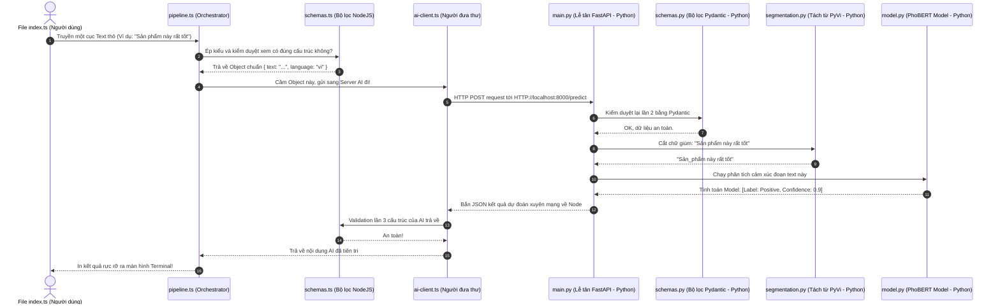

# Luồng Dữ Liệu & Sự Kiện Hệ Thống (Data & Event Flow)

Tài liệu này mô tả chi tiết đường đi của dữ liệu từ khi người dùng nhập vào, cho đến khi chui qua hệ thống Node.js, truyền sang AI Service (Python) và trả thành quả cuối cùng về lại.

---

## 1. Hành trình Sự kiện tổng quan (Event Flow)

Sự kiện bắt đầu khi file `engine/src/index.ts` khởi chạy hàm demo. Dưới đây là các mốc sự kiện liên hoàn (Sequence):



---

## 2. Giải Phẫu Chi Tiết Từng Lớp Chuyển Đổi (Data Transformation)

Dưới đây là hình thái (hình dạng kiểu dữ liệu) của dòng ký tự sẽ bị biến đổi như thế nào sau quá trình chu du.

### Bước 1: Khởi nguồn (Ở Node.js)
Trong `index.ts`, lập trình viên truyền vào một cục dữ liệu "thô và chưa rõ ràng":
```json
{
  "text": "Tôi rất thích sản phẩm AI này",
  "language": "vi"
}
```

### Bước 2: Bộ lọc gác cửa `schemas.ts` (Zod)
Dữ liệu trên chảy qua hàm validation. Tại đây:
- Kiểm tra `text` có phải là chữ (String) không.
- Kiểm tra độ dài có bị bỏ trống hoặc lớn hơn 5000 ký tự (Chống spam).
- Nếu bị rỗng, lập tức chối từ (Bắn lỗi `PipelineFailure`).
- Nếu thành công, đóng gói nó thành một Object có Type rõ ràng: `PredictRequest`.

### Bước 3: Người đưa thư `ai-client.ts`
Chuyển Object trên thành dạng **JSON thuần**, kèm theo Header `Content-Type: application/json` và bắn qua đường mạng (HTTP POST) sang cổng số 8000 của máy tính.

### Bước 4: Lễ Tân `main.py` và Cửa thứ hai `schemas.py` (Pydantic)
- FastAPI đón gói JSON. 
- Ngay lập tức, `schemas.py` đè gói JSON ra kiểm tra chéo lần 2 (Đề phòng trường hợp ai đó dùng Postman gọi trộm server phá hoại mà không thông qua nhánh code Nodejs).
- Từ JSON chuyển hoá thành đối tượng hướng đối tượng `PredictRequest` bằng sức mạnh Python.

### Bước 5: Tiền xử lý `segmentation.py`
Data trích xuất riêng lấy mục `text`: `"Tôi rất thích sản phẩm AI này"`.
Sau khi chạy qua PyVi, nó ra lò bị biến đổi cấu trúc thành chuỗi tách từ:
> `Biến segmented_text = "Tôi rất thích sản_phẩm AI này"`

### Bước 6: Suy luận não bộ PhoBERT (`model.py`)
Text tách từ được đổ vào model HuggingFace. Tại đây nó diễn ra sự phân rã đáng sợ (Tokenizer):
- Text biến thành mảng số ma trận (Array of IDs): `[0, 423, 221, 659, 134...]`
- Mảng ném qua các lớp Transformer kích thước khổng lồ của PhoBERT để quy hồi ra một lớp trọng số toán học.
- Dò trọng số lớn nhất lấy ra kết quả:
  - `label`: `"positive"`
  - `confidence`: `0.982`

### Bước 7: Đóng gói Rời đi
Tại `main.py`, mọi thu hoạch được nhào nặn lại thành 1 hộp xốp Pydantic `PredictResponse` gửi trả về cho NodeJS.

```json
{
  "input_text": "Tôi rất thích sản phẩm AI này",
  "segmented_text": "Tôi rất thích sản_phẩm AI này",
  "tokens": ["Tôi", "rất", "thích", "sản_phẩm", "AI", "này"],
  "label": "positive",
  "confidence": 0.982,
  "processing_time_ms": 145.2
}
```

### Bước 8: Kết thúc
Cái hộp JSON này chạy qua mạng về lại `ai-client.ts` bên Node. Lại gửi lên bác bảo vệ `Zod` soi một lần cuối có đúng khung chứa đó không. 
Kiểm tra an toàn xong, `pipeline.ts` in nguyên hộp kết quả đẹp mắt ra cho người dùng coi!
