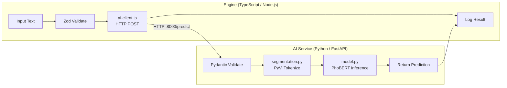

# Type-safe Data Pipeline: TypeScript ↔ Python

Thiết kế hệ thống **Type-safe Data Pipeline** lai giữa TypeScript (Zod + Node.js) và Python (FastAPI + PhoBERT) để xử lý văn bản tiếng Việt.

## Tổng quan Kiến trúc (Architecture Overview)



## Cấu trúc Dự án (Project Structure)

```
Test/
├── engine/                          # Dịch vụ TypeScript
│   ├── package.json
│   ├── tsconfig.json
│   └── src/
│       ├── schemas.ts               # [NEW] Zod schemas (ánh xạ từ Pydantic)
│       ├── ai-client.ts             # [NEW] HTTP client gọi Dịch vụ AI Python
│       ├── pipeline.ts              # [NEW] executePipeline orchestrator
│       └── index.ts                 # [NEW] Điểm vào & demo
│
├── ai-service/                      # Dịch vụ Python
│   ├── requirements.txt
│   ├── app/
│   │   ├── __init__.py
│   │   ├── main.py                  # [NEW] Ứng dụng FastAPI + endpoints
│   │   ├── schemas.py               # [NEW] Pydantic schemas (ánh xạ từ Zod)
│   │   ├── segmentation.py          # [NEW] PyVi tách từ tiếng Việt
│   │   └── model.py                 # [NEW] Load mô hình PhoBERT & suy luận
│   └── run.py                       # [NEW] Uvicorn runner
│
└── README.md                        # [NEW] Hướng dẫn cài đặt & tích hợp
└── VN_README.md                     # [NEW] Hướng dẫn cài đặt & tích hợp (Tiếng Việt)
└── implementation_plan.md           # [NEW] Kế hoạch triển khai
└── VN_implementation_plan.md        # [NEW] Kế hoạch triển khai (Tiếng Việt)
```

## Các Thay đổi Đề xuất (Proposed Changes)

### 1. Hợp đồng Schema Chung (Nguồn chân lý - Source of Truth)

> [!IMPORTANT]
> Các Pydantic schema trong Python là **nguồn chân lý (source of truth)**. Các Zod schema trong TS phải phản ánh chính xác chúng. Cả hai định nghĩa cùng cấu trúc dữ liệu cho request/response.

**Hợp đồng Dữ liệu Chia sẻ:**

| Trường (Field) | Kiểu (Type) | Mô tả (Description) |
|-------|------|-------------|
| `PredictRequest.text` | `string` | Đầu vào văn bản tiếng Việt thô |
| `PredictRequest.language` | `"vi" \| "en"` (tuỳ chọn, mặc định `"vi"`) | Ngôn ngữ |
| `PredictResponse.input_text` | `string` | Trả lại văn bản đầu vào |
| `PredictResponse.segmented_text` | `string` | Văn bản sau khi tách từ |
| `PredictResponse.tokens` | `string[]` | Danh sách các token |
| `PredictResponse.label` | `string` | Nhãn dự đoán |
| `PredictResponse.confidence` | `number` | Điểm độ tin cậy (0–1) |
| `PredictResponse.processing_time_ms` | `number` | Thời gian xử lý |

---

### 2. Engine (TypeScript)

#### [NEW] schemas.ts
- Định nghĩa `PredictRequestSchema` và `PredictResponseSchema` bằng Zod.
- Export các kiểu TypeScript được suy luận qua `z.infer<>`.
- Bao gồm các hàm helper xác thực runtime (`validateRequest`, `validateResponse`).

#### [NEW] ai-client.ts
- Class `AIClient` với `baseUrl` có thể cấu hình (mặc định `http://localhost:8000`).
- `predict(request: PredictRequest): Promise<PredictResponse>` — gọi `POST /predict`.
- `healthCheck(): Promise<boolean>` — gọi `GET /health`.
- Sử dụng `fetch` native (Node 18+) — không cần thư viện HTTP bên ngoài.
- Phản hồi được xác thực qua Zod trước khi trả về.

#### [NEW] pipeline.ts
- Hàm `executePipeline(input: unknown): Promise<PipelineResult>`:
  1. **Validate** — Parse dữ liệu thô bằng Zod schema, dừng sớm nếu dữ liệu không hợp lệ.
  2. **Call AI** — Gửi request đã xác thực tới dịch vụ Python qua `AIClient`.
  3. **Log Result** — Log có cấu trúc bao gồm thời gian, đầu vào/đầu ra.
- Kiểu trả về bao gồm trạng thái, dữ liệu đầu vào đã xác thực, phản hồi AI và siêu dữ liệu thực hiện.
- Xử lý lỗi bằng discriminated union: `{ success: true, data } | { success: false, error }`.

#### [NEW] index.ts
- Script demo chạy pipeline với văn bản tiếng Việt mẫu.
- Hiển thị các trường hợp xác thực thành công/thất bại.

---

### 3. AI Service (Python)

#### [NEW] schemas.py
- `PredictRequest(BaseModel)` và `PredictResponse(BaseModel)` dùng Pydantic v2.
- Field validators cho độ dài văn bản, tuỳ chọn ngôn ngữ.
- Bản sao chính xác của các Zod schemas.

#### [NEW] segmentation.py
- Class `VietnameseSegmenter` dùng `ViTokenizer` của PyVi.
- `segment(text: str) -> SegmentResult` — tách văn bản tiếng Việt thành dạng tách từ.
- Trả về cả chuỗi đã tách từ và danh sách token.

#### [NEW] model.py
- Class `PhoBERTPredictor`:
  - `__init__()` — lazy-loads tokenizer và model `vinai/phobert-base` từ HuggingFace.
  - `predict(segmented_text: str) -> PredictResult` — tokenize → inference → softmax → label + confidence.
- Dùng `torch.no_grad()` để tiết kiệm bộ nhớ.
- Bao gồm text classification head (cho demo phân loại văn bản/cảm xúc).

#### [NEW] main.py
- FastAPI app với middleware CORS (cho phép TS engine gọi).
- `POST /predict` — nhận `PredictRequest`, chạy phân tách → suy luận model → trả về `PredictResponse`.
- `GET /health` — endpoint kiểm tra trạng thái sức khoẻ.
- Model tải 1 lần lúc startup qua FastAPI lifespan.

---

### 4. Các file cấu hình & Cài đặt

#### [NEW] package.json
- Dependencies: `zod`, `typescript`, `tsx` (để chạy TS trực tiếp).
- Scripts: `dev`, `build`, `start`.

#### [NEW] tsconfig.json
- Target: ES2022, module: NodeNext, chế độ strict BẬT.

#### [NEW] requirements.txt
- `fastapi`, `uvicorn[standard]`, `pydantic>=2.0`, `transformers`, `torch`, `pyvi`.

#### [NEW] README.md / VN_README.md
- Hướng dẫn cấu hình đầy đủ cho cả hai dịch vụ.
- Tuỳ chọn Docker-compose cho triển khai container hóa.
- Tài liệu hợp đồng API.

## Cần Người Dùng Đánh Giá (User Review Required)

> [!IMPORTANT]
> **Loại Tác vụ PhoBERT**: Kế hoạch này dùng PhoBERT cho **phân loại văn bản** (phân tích cảm xúc) làm tác vụ mẫu. PhoBERT cũng có thể làm NER, điền vào chỗ trống, v.v. Bạn có muốn chọn tác vụ khác không?

> [!WARNING]
> **Kích thước Model**: `vinai/phobert-base` có dung lượng ~540MB. Lần chạy đầu tiên sẽ tải mô hình từ HuggingFace. Hãy đảm bảo bạn có đủ dung lượng ổ đĩa và kết nối internet ổn định.

> [!NOTE]
> **PyVi so với VnCoreNLP**: Kế hoạch này sử dụng **PyVi** (`ViTokenizer`) để tách từ như yêu cầu. VnCoreNLP chính xác hơn nhưng yêu cầu cài đặt Java. PyVi là thuần Python và dễ cài đặt thiết lập hơn.

## Các Câu hỏi Mở (Open Questions)

1. **Các Nhãn Phân Loại**: Bộ phân loại cảm xúc nên xuất ra các nhãn nào? Kế hoạch mặc định: `["positive", "negative", "neutral"]`.
2. **Xác thực (Authentication)**: Dịch vụ API có nên có xác thực (như khoá API) không hay chỉ dùng để phát triển nội bộ?
3. **Docker**: Tôi có nên cung cấp file `docker-compose.yml` để dễ dàng quản lý (orchestration) hay cấu hình thủ công là đủ?

## Kế hoạch Xác minh (Verification Plan)

### Các Bài kiểm tra Tự động (Automated Tests)
1. **TypeScript**: Chạy `npx tsx src/index.ts` để thực thi pipeline mẫu và xác minh tính hợp lệ Zod + các cuộc gọi HTTP.
2. **Python**: Chạy `uvicorn app.main:app` và kiểm tra với `curl -X POST http://localhost:8000/predict -H "Content-Type: application/json" -d '{"text": "Tôi rất thích sản phẩm này"}'`.
3. **Tích hợp**: Khởi chạy Python service → Chạy phân đoạn TS → Xác minh toàn bộ luồng.

### Xác minh Thủ công (Manual Verification)
- Xác minh sự liên kết schema bằng cách so sánh các định nghĩa thuộc tính Zod và Pydantic với nhau.
- Cung cấp văn bản tiếng Việt và thử nghiệm các trường hợp (ví dụ: chuỗi rỗng, văn bản quá dài, ngôn ngữ lẫn lộn).
