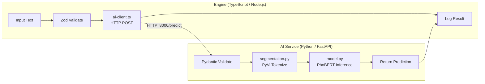

# Type-safe Data Pipeline: TypeScript ↔ Python

Thiết kế hệ thống **Type-safe Data Pipeline** lai giữa TypeScript (Zod + Node.js) và Python (FastAPI + PhoBERT) để xử lý văn bản tiếng Việt.

## Architecture Overview



## Project Structure

```
Test/
├── engine/                          # TypeScript Service
│   ├── package.json
│   ├── tsconfig.json
│   └── src/
│       ├── schemas.ts               # [NEW] Zod schemas (mirroring Pydantic)
│       ├── ai-client.ts             # [NEW] HTTP client to call Python AI Service
│       ├── pipeline.ts              # [NEW] executePipeline orchestrator
│       └── index.ts                 # [NEW] Entry point & demo
│
├── ai-service/                      # Python Service
│   ├── requirements.txt
│   ├── app/
│   │   ├── __init__.py
│   │   ├── main.py                  # [NEW] FastAPI app + endpoints
│   │   ├── schemas.py               # [NEW] Pydantic schemas (mirroring Zod)
│   │   ├── segmentation.py          # [NEW] PyVi Vietnamese word segmentation
│   │   └── model.py                 # [NEW] PhoBERT model loading & inference
│   └── run.py                       # [NEW] Uvicorn runner
│
└── README.md                        # [NEW] Setup & integration guide
```

## Proposed Changes

### 1. Shared Schema Contract (Source of Truth)

> [!IMPORTANT]
> The Pydantic schemas in Python are the **source of truth**. The Zod schemas in TS must mirror them exactly. Both define the same data shapes for request/response.

**Shared Data Contract:**

| Field | Type | Description |
|-------|------|-------------|
| `PredictRequest.text` | `string` | Raw Vietnamese text input |
| `PredictRequest.language` | `"vi" \| "en"` (optional, default `"vi"`) | Language hint |
| `PredictResponse.input_text` | `string` | Echo of input |
| `PredictResponse.segmented_text` | `string` | After word segmentation |
| `PredictResponse.tokens` | `string[]` | List of tokens |
| `PredictResponse.label` | `string` | Predicted label |
| `PredictResponse.confidence` | `number` | Confidence score (0–1) |
| `PredictResponse.processing_time_ms` | `number` | Time taken for inference |

---

### 2. Engine (TypeScript)

#### [NEW] [schemas.ts](file:///Users/nguyensontung/Downloads/In_Class/CS/CS370/Test/engine/src/schemas.ts)
- Define `PredictRequestSchema` and `PredictResponseSchema` using Zod
- Export inferred TypeScript types via `z.infer<>`
- Include runtime validation helpers (`validateRequest`, `validateResponse`)

#### [NEW] [ai-client.ts](file:///Users/nguyensontung/Downloads/In_Class/CS/CS370/Test/engine/src/ai-client.ts)
- `AIClient` class with configurable `baseUrl` (default `http://localhost:8000`)
- `predict(request: PredictRequest): Promise<PredictResponse>` — calls `POST /predict`
- `healthCheck(): Promise<boolean>` — calls `GET /health`
- Uses native `fetch` (Node 18+) — no external HTTP library needed
- Response validated through Zod before returning

#### [NEW] [pipeline.ts](file:///Users/nguyensontung/Downloads/In_Class/CS/CS370/Test/engine/src/pipeline.ts)
- `executePipeline(input: unknown): Promise<PipelineResult>` function:
  1. **Validate** — Parse raw input with Zod schema, fail fast on invalid data
  2. **Call AI** — Send validated request to Python service via `AIClient`
  3. **Log Result** — Structured logging with timestamps, input/output, timing
- Return type includes status, validated input, AI response, and execution metadata
- Error handling with discriminated union: `{ success: true, data } | { success: false, error }`

#### [NEW] [index.ts](file:///Users/nguyensontung/Downloads/In_Class/CS/CS370/Test/engine/src/index.ts)
- Demo script that runs the pipeline with sample Vietnamese text
- Shows validation success/failure cases

---

### 3. AI Service (Python)

#### [NEW] [schemas.py](file:///Users/nguyensontung/Downloads/In_Class/CS/CS370/Test/ai-service/app/schemas.py)
- `PredictRequest(BaseModel)` and `PredictResponse(BaseModel)` using Pydantic v2
- Field validators for text length, language enum
- Exact mirror of the Zod schemas

#### [NEW] [segmentation.py](file:///Users/nguyensontung/Downloads/In_Class/CS/CS370/Test/ai-service/app/segmentation.py)
- `VietnameseSegmenter` class using PyVi's `ViTokenizer`
- `segment(text: str) -> SegmentResult` — splits Vietnamese text into word-segmented form
- Returns both the segmented string and token list

#### [NEW] [model.py](file:///Users/nguyensontung/Downloads/In_Class/CS/CS370/Test/ai-service/app/model.py)
- `PhoBERTPredictor` class:
  - `__init__()` — lazy-loads `vinai/phobert-base` tokenizer and model from HuggingFace
  - `predict(segmented_text: str) -> PredictResult` — tokenize → inference → softmax → label + confidence
- Uses `torch.no_grad()` for memory efficiency
- Includes text classification head (for sentiment/topic classification demo)

#### [NEW] [main.py](file:///Users/nguyensontung/Downloads/In_Class/CS/CS370/Test/ai-service/app/main.py)
- FastAPI app with CORS middleware (allows TS engine to call it)
- `POST /predict` — receives `PredictRequest`, runs segmentation → model inference → returns `PredictResponse`
- `GET /health` — health check endpoint
- Model loaded once at startup via FastAPI lifespan

---

### 4. Configuration & Setup Files

#### [NEW] [package.json](file:///Users/nguyensontung/Downloads/In_Class/CS/CS370/Test/engine/package.json)
- Dependencies: `zod`, `typescript`, `tsx` (for running TS directly)
- Scripts: `dev`, `build`, `start`

#### [NEW] [tsconfig.json](file:///Users/nguyensontung/Downloads/In_Class/CS/CS370/Test/engine/tsconfig.json)
- Target: ES2022, module: NodeNext, strict mode ON

#### [NEW] [requirements.txt](file:///Users/nguyensontung/Downloads/In_Class/CS/CS370/Test/ai-service/requirements.txt)
- `fastapi`, `uvicorn[standard]`, `pydantic>=2.0`, `transformers`, `torch`, `pyvi`

#### [NEW] [README.md](file:///Users/nguyensontung/Downloads/In_Class/CS/CS370/Test/README.md)
- Full setup instructions for both services
- Docker-compose option for containerized deployment
- API contract documentation

## User Review Required

> [!IMPORTANT]
> **PhoBERT Task Type**: The plan uses PhoBERT for **text classification** (sentiment analysis) as a demo task. PhoBERT can also do NER, fill-mask, etc. Do you want a different task type?

> [!WARNING]
> **Model Size**: `vinai/phobert-base` is ~540MB. The first run will download the model from HuggingFace. Ensure you have sufficient disk space and a stable internet connection.

> [!NOTE]
> **PyVi vs VnCoreNLP**: The plan uses **PyVi** (`ViTokenizer`) for word segmentation as requested. VnCoreNLP is more accurate but requires Java. PyVi is pure Python and simpler to set up.

## Open Questions

1. **Classification Labels**: What labels should the sentiment classifier output? Default plan: `["positive", "negative", "neutral"]`
2. **Authentication**: Should the API have any auth (API key, etc.) or is this a local development setup only?
3. **Docker**: Should I include a `docker-compose.yml` for easy orchestration, or is manual setup sufficient?

## Verification Plan

### Automated Tests
1. **TypeScript**: Run `npx tsx src/index.ts` to execute the demo pipeline and verify Zod validation + HTTP calls
2. **Python**: Run `uvicorn app.main:app` and test with `curl -X POST http://localhost:8000/predict -H "Content-Type: application/json" -d '{"text": "Tôi rất thích sản phẩm này"}'`
3. **Integration**: Start Python service → Run TS pipeline → Verify end-to-end flow

### Manual Verification
- Verify schema alignment by comparing Zod and Pydantic field definitions side by side
- Test with various Vietnamese text inputs including edge cases (empty string, very long text, mixed language)
